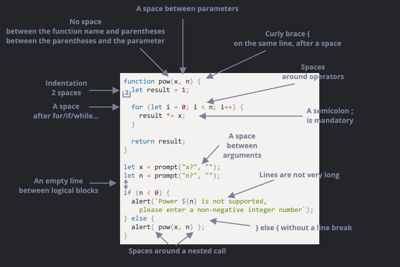

### Chrome으로 디버깅하기

디버깅(Debugging)은 스크립트 내 에러를 검출해 제거하는 일련의 과정을 의미

➡️ F12(MacOS: Cmd+Opt+I)를 눌러 개발자 도구

1. Sources 패널 
    
    
    - 토글 버튼 을 누르면 navigator가 열리면서 현재 사이트와 관련된 파일들이 나열됨
    
    
    - Sources 패널은 크게 세 가지로 구성됨
        1. 파일 탐색 영역: 페이지를 구성하는 데 쓰인 모든 리소스를 트리 형태로 보여줌
        2. 코드 에디터 영역: 리소스 영역에서 선택한 파일의 코드를 보여줌. 소스코드 편집도 가능
        3. 자바스크립트 디버깅 영역: 디버깅 관련 기능 제공 
    - 토글 버튼을 다시 누르면 파일 탐색 영역이 사라짐
    
2. 콘솔
    
    
    - 여기에 명령어를 입력하고 Enter를 누르면 입력한 명령어가 실행됨
    - `1+2`를 입력하면 `3`이 출력되고, `hello("debugger")`를 입력하면 `undefined`가 출력되됨
        - `undefined`가 출력되는 이유는 `hello("debugger")`가 아무것도 반환하지 않기 때문 !
    
3. 중단점
    
    
    
    - *중단점(breakpoint)* 은 말 그대로 자바스크립트의 실행이 중단되는 코드 내 지점을 의미
    - 중단점을 이용하면 **실행이 중지된 시점**에 **변수가 어떤 값을 담고 있는지** 알 수 있음
    - 또한 **실행이 중지된 시점을 기준으로 명령어를 실행**가능 (디버깅)
    - Sources 패널 우측의 디버깅 영역을 보면 중단점 목록 확인 가능
    - 파일 여러 개에 다수의 중단점을 설정해 놓은 경우, 디버깅 영역을 이용하면 아래와 같은 작업도 가능
        - 항목을 클릭해 해당 중단점이 설정된 곳으로 바로 이동
        - 체크 박스 선택을 해제해 해당 중단점을 비활성화
        - 마우스 오른쪽 버튼을 클릭했을 때 나오는 ‘Remove breakpoint’ 옵션을 통해 중단점을 삭제
        

✅ 스크립트 내에 `debugger` 명령어를 적어주면 중단점을 설정한 것과 같은 효과를 볼 수 있음

```jsx
function hello(name) {
  let phrase = `Hello, ${name}!`;

  debugger;  // <-- 여기서 실행이 멈춥니다.

  say(phrase);
}
```

✅ **멈추면 보이는 것들**


- 중단점을 작동시키면 위 사진처럼 4번째 줄에서 실행이 중단됨
- 이상태에서 디버킹 영역의 `▼`를 클릭하면 나오는 하위 패널은 아래와 같은 기능을 제공함
    1. **`Watch` – 표현식을 평가하고 결과를 보여줌**
        - Add Expression 버튼 `+`를 클릭해 원하는 표현식을 입력한 후 [Enter]를 누르면 **중단 시점의 값**을 보여줌
        - 입력한 표현식은 실행 과정 중에 **계속해서 재평가**됨.
    2. **`Call Stack` – 코드를 해당 중단점으로 안내한 실행 경로를 역순으로 표시**
        - 실행은 `index.html` 안에서 `hello()`를 호출하는 과정 중에 멈춤.
        - 함수 `hello` 내에 중단점을 설정했기 때문에, 콜 스택(Call Stack) 최상단엔 `hello`가 위치함.
        - `index.html`에서 함수 `hello`를 정의하지 않았기 때문에 콜 스택 하단엔 'anonymous’가 출력됨.
        - 콜 스택 내의 항목을 클릭하면 디버거가 해당 코드로 휙 움직이고, 변수 역시 재평가됨
    3. **`Scope` – 현재 정의된 모든 변수를 출력합**
        - `Local`은 함수의 지역변수, 지역 변수 정보는 소스 코드 영역에서도 확인(강조 표시)가능
        - `Global`은 함수 바깥에 정의된 전역 변수
        - `Local` 하위 항목으로 `this`에 대한 정보도 출력됨

✅ Console.log

`console.log` 함수를 이용하면 원하는 것을 콘솔에 출력 가능

```jsx
// 콘솔창을 열어 결과를 확인해 보세요.
for (let i = 0; i < 5; i++) {
  console.log("숫자", i);
}
```

- 결과는 콘솔창에만 있기 때문에 일반 사용자는 결과를 볼 수 없음
- 결과를 보려면 개발자 도구의 콘솔 패널을 직접 열어야 함

✅ [구글에서 제공하는 개발자 도구 공식 메뉴얼](https://developers.google.com/web/tools/chrome-devtools) 

### 코딩 스타일

✔️개발자는 가능한 한 간결하고 읽기 쉽게 코드를 작성해야 함

**문법**


✅ **중괄호 (curly brace)**

- 대부분의 자바스크립트 프로젝트에서 여는 중괄호는 Eqyptian 스타일을 따라, 새로운 줄이 아닌 상응하는 키워드와 같은 줄에 작성함. 여기에 더하여 중괗로 앞엔 공백이 하나 있어야함
    
    ```jsx
    if (condition) {
      // 코드 1
      // 코드 2
      // ...코드 n...
    }
    ```
    
- Example
    1. 😠 초보 개발자들은 아래처럼 코드를 작성하곤 하는데, 중괄호가 필요하지 않기 때문에 추천하지 않음
        
        ```jsx
        if (n < 0) {alert(`Power ${n} is not supported`);}
        ```
        
    2. 😠 중괄호 없이 새로운 줄에 코드를 작성할 수도 있는데, 이렇게 하면 새로운 코드 라인을 추가할 때 에러가 발생함. 절대 이 방법은 ❌
        
        ```jsx
        if (n < 0)
          alert(`Power ${n} is not supported`);
        ```
        
    3. 😏 코드가 짧다면 중괄호 없이 한 줄에 쓰는 방법도 OK
        
        ```jsx
        if (n < 0) alert(`Power ${n} is not supported`);
        ```
        
    4. 😃 가장 추천하는 방법 (가독성 Good)
        
        ```jsx
        if (n < 0) {
          alert(`Power ${n} is not supported`);
        }
        ```
        

✅ **가로길이**

- 코드의 가로 길이가 길어진다면 여러 줄로 나눠 작성
- Example
    
    ```jsx
    // 백틱(`)을 사용하면 문자열을 여러 줄로 쉽게 나눌 수 있습니다.
    let str = `
      ECMA International's TC39 is a group of JavaScript developers,
      implementers, academics, and more, collaborating with the community
      to maintain and evolve the definition of JavaScript.
    `;
    ```
    
    `if`문이라면 아래와 같이 작성할 수 있음 !
    
    ```jsx
    if (
      id === 123 &&
      moonPhase === 'Waning Gibbous' &&
      zodiacSign === 'Libra'
    ) {
      letTheSorceryBegin();
    }
    ```
    
    최대 가로 길이는 팀원들과 합의해 정하는게 좋음. 대개 80자나 120자로 제한하는 게 일반적입니다.
    

✅ **들여쓰기**

- **가로 들여쓰기: 스페이스 두 개 혹은 네 개를 사용해 만듦**
    
    가로 들여쓰기는 스페이스 두 개 혹은 네 개를 사용하거나 탭 키(Tab)를 이용해 만들 수 있음
    
    어떤 방법을 쓸지에 대한 논쟁은 오래전부터 있었는데, 요즘엔 탭 대신 **스페이스를 이용**하는 게 더 우위 !
    
    탭 대신 스페이스를 이용했을 때의 장점 ➡️ 들여쓰기 정도를 좀 더 유연하게 변경 가능 
    
    아래 예시처럼 인수 모두의 위치를 여는 괄호와 맞출 수 있죠.
    
    ```jsx
    show(parameters,
         aligned, // 스페이스 다섯 개를 이용해 들여쓰기 함
         one,
         after,
         another
      ) {
      // ...
    }
    ```
    

- **세로 들여쓰기: 논리 블록 사이에 넣어 코드를 분리해주는 새 줄**
    
    함수 하나에 논리 블록 여러 개가 들어갈 수 있음 
    
    아래 예시에서 변수 선언, 반복문, 리턴문 사이에 세로 들여쓰기를 해주는 빈 줄을 넣어 코드를 분리함
    
    ```jsx
    function pow(x, n) {
      let result = 1;
      //              <--
      for (let i = 0; i < n; i++) {
        result *= x;
      }
      //              <--
      return result;
    }
    ```
    
    이렇게 여분의 줄을 넣어주면 코드의 가독성이 좋아짐 
    
    읽기 쉬운 코드를 만들려면 세로 들여쓰기 없이 코드를 아홉 줄 이상 연속해서 쓰지 말 것 !
    

✅ **세미콜론**

- 자바스크립트 엔진에 의해 무시되더라도, 모든 구문의 끝엔 세미콜론을 써주는 것이 좋음

✅ **중첩레벨**

- 가능하면 너무 깊은 중첩문은 사용하지 않도록 할 것
- 반복문을 사용할 때 중첩문의 깊이가 깊어지면, `[continue](https://ko.javascript.info/while-for#continue)` 지시자를 쓰는 게 좋은 대안이 될 수 있음
- `if`문으로 조건을 처리하는 예시
    
    ```jsx
    for (let i = 0; i < 10; i++) {
      if (cond) {
        ... // <- 중첩 레벨이 하나 더 늘어났습니다.
      }
    }
    ```
    
    ➡️ 위 코드는 `continue`를 써서 아래와 같이 바꿀 수 있음
    
    ```jsx
    for (let i = 0; i < 10; i++) {
      if (!cond) *continue*;
      ...  // <- 추가 중첩 레벨이 추가되지 않습니다.
    }
    ```
    
- `if/else`와 `return`문을 조합하면 위 예시와 유사하게 중첩 레벨을 줄여 코드의 가독성을 높일 수 있음
- 아래 두 예시는 동일하게 동작 !
    
    ```jsx
    function pow(x, n) {
      if (n < 0) {
        alert("'n'은 음수가 될 수 없습니다.");
      } else {
        let result = 1;
    
        for (let i = 0; i < n; i++) {
          result *= x;
        }
    
        return result;
      }
    }
    ```
    
    ```jsx
    function pow(x, n) {
      if (n < 0) {
        alert("'n'은 음수가 될 수 없습니다.");
        return;
      }
    
      let result = 1;
    
      for (let i = 0; i < n; i++) {
        result *= x;
      }
    
      return result;
    }
    ```
    
    ➡️  `n < 0`인 '특별한 상황’을 앞에 두고, 그 안에 `return`문을 추가해주었더니 가독성이 훨씬 좋아짐
    
    ➡️ 특별한 상황인지를 확인하고 조건을 통과하면, 추가 중첩 없이 ‘주요’ 코드 흐름으로 넘어갈 수 있음
    

✅ **함수 위치**

1. 헬퍼 함수를 사용하는 코드 *위*에서 헬퍼 함수를 모아 선언하기
    
    ```jsx
    // *함수 선언*function createElement() {
      ...
    }
    
    function setHandler(elem) {
      ...
    }
    
    function walkAround() {
      ...
    }
    
    // *헬퍼 함수를 사용하는 코드*let elem = createElement();
    setHandler(elem);
    walkAround();
    ```
    
2. 코드를 먼저, 함수는 그 다음에 선언하기
    
    ```jsx
    // *헬퍼 함수를 사용하는 코드*let elem = createElement();
    setHandler(elem);
    walkAround();
    
    // --- *헬퍼 함수* ---
    function createElement() {
      ...
    }
    
    function setHandler(elem) {
      ...
    }
    
    function walkAround() {
      ...
    }
    ```
    
3. 혼합: 코드 바로 위에서 필요한 헬퍼 함수 그때그때 선언하기

 ➡️ 대개는 두 번째 방법으로 코드를 정돈하는 걸 선호

 ➡️ 사람들은 이 코드가 '무엇을 하는지’를 생각하며 읽기 때문에, 코드가 먼저 나오는 것이 자연스러움

✅ **스타일 가이드**

- [Google의 자바스크립트 스타일 가이드](https://google.github.io/styleguide/jsguide.html)
- [Airbnb의 자바스크립트 스타일 가이드](https://github.com/airbnb/javascript)
- [Idiomatic.JS](https://github.com/rwaldron/idiomatic.js)
- [StandardJS](https://standardjs.com/)

✅ **Linter**

- 작성한 코드가 스타일 가이드를 준수하고 있는지를 자동으로 확인가능
- 스타일 개선과 관련된 제안 또한 받을 수 있음
    - [JSLint](http://www.jslint.com/) – 역사가 오래된 linter
    - [JSHint](http://www.jshint.com/) – JSLint보다 세팅이 좀 더 유연한 linter
    - [ESLint](http://eslint.org/) – 가장 최근에 나온 linter
- ESLint를 사용한다고 가정했을 때 아래 절차를 따르면 에디터와 linter를 통합해 사용할 수 있습니다.
    1. [Node.js](https://nodejs.org/)를 설치
    2. npm(자바스크립트 패키지 매니저)을 사용해 다음 명령어로 ESLint를 설치
     `npm install -g eslint`
    3. 현재 작성 중인 자바스크립트 프로젝트의 루트 폴더(프로젝트 관련 파일이 담긴 폴더)에 `.eslintrc`라는 설정 파일을 생성
    4. 에디터에 ESLint 플러그인을 설치하거나 활성화
    

### 주석

주석(comment)은 **어떻게 코드가 동작하는지**, **왜 코드가 동작하는지를 설명**하는 데 쓰임

😡 **좋지 않은 주석**

- 초심자들은 주석에 '코드에서 무슨 일이 일어나는지’에 대한 내용을 적곤 함
    
    ```jsx
    // 이 코드는 (...)과 (...)을 수행합니다
    // A라는 개발자가 이 기능에 대해 알고 있으며...
    very;
    complex;
    code;
    ```
    
- BUT, 좋은 코드에는 설명이 담긴(explanatory) 주석이 많아서는 안됨
- 주석 없이 **코드 자체만으로 코드가 무슨 일을 하는지** 쉽게 이해할 수 있어야 함

✅ **리팩토링 팁: 함수 분리하기**

- 함수 내 코드 일부를 새로운 함수로 옮기는 게 유익할 때도 있음
    
    ```jsx
    function showPrimes(n) {
      nextPrime:
      for (let i = 2; i < n; i++) {
    
        // i가 소수인지를 확인함
        for (let j = 2; j < i; j++) {
          if (i % j == 0) continue nextPrime;
        }
    
        alert(i);
      }
    }
    ```
    
- 코드 일부를 `isPrime` 이라는 새로운 함수를 만들어 옮기면 더 나은 코드 작성 가능
    
    ```jsx
    function showPrimes(n) {
    
      for (let i = 2; i < n; i++) {
        if (!isPrime(i)) continue;
    
        alert(i);
      }
    }
    
    function isPrime(n) {
      for (let i = 2; i < n; i++) {
        if (n % i == 0) return false;
      }
    
      return true;
    }
    ```
    
    ➡️ ***자기 설명적인(self-descriptive)* 코드**: 함수 이름 자체가 주석 역할을 하므로 코드를 쉽게 이해 가능
    

**✅ 리팩토링 팁: 함수 만들기**

- 아래와 같이 코드가 “아래로 주-욱 늘어져 있는” 경우
    
    ```jsx
    // 위스키를 더해줌
    for(let i = 0; i < 10; i++) {
      let drop = getWhiskey();
      smell(drop);
      add(drop, glass);
    }
    
    // 주스를 더해줌
    for(let t = 0; t < 3; t++) {
      let tomato = getTomato();
      examine(tomato);
      let juice = press(tomato);
      add(juice, glass);
    }
    
    // ...
    ```
    
- 이럴 땐 새로운 함수를 만들고, 코드 일부를 새로 만든 함수에 옮기는 것이 좋음
    
    ```jsx
    addWhiskey(glass);
    addJuice(glass);
    
    function addWhiskey(container) {
      for(let i = 0; i < 10; i++) {
        let drop = getWhiskey();
        //...
      }
    }
    
    function addJuice(container) {
      for(let t = 0; t < 3; t++) {
        let tomato = getTomato();
        //...
      }
    }
    ```
    

➡️ 함수는 주석이 없어도 그 존재 자체가 무슨 역할을 하는지 설명할 수 있어야 함 (자기 설명적)

➡️ 코드를 분리해 작성하면 더 나은 코드 구조가 됨

➡️ 이런 가이드를 잘 지켜 작성하면, 함수가 어떤 동작을 하는지, 무엇을 받고, 반환하는지가 명확해짐

😊 **좋은 주석**

- **아키텍처를 설명하는 주석**
    
    고차원 수준 컴포넌트 개요, 컴포넌트 간 상호작용에 대한 설명, 상황에 따른 제어 흐름 등. 이런 주석은 조감도 역할을 해줌. 고차원 수준의 아키텍처 다이어그램을 그리는 데 쓰이는 언어인 [UML](http://wikipedia.org/wiki/Unified_Modeling_Language)도 시간을 내어 공부해 보는걸 추천 !
    
- **함수 용례와 매개변수 정보를 담고 있는 주석**
    
    [JSDoc](http://en.wikipedia.org/wiki/JSDoc)이라는 특별한 문법을 사용하면 함수에 관한 문서를 쉽게 작성 가능(함수 용례, 매개변수, 반환 값)
    
    ```jsx
    /**
     * x를 n번 곱한 수를 반환함
     *
     * @param {number} x 거듭제곱할 숫자
     * @param {number} n 곱할 횟수, 반드시 자연수여야 함
     * @return {number} x의 n 거듭제곱을 반환함
     */
    function pow(x, n) {
      ...
    }
    ```
    
- **왜 이런 방법으로 문제를 해결했는지를 설명하는 주석**
    
    문제 해결 방법이 여러 가지인데 왜 하필이면 이 방법을 택했는지 의문이 들 때가 있을 수 있음. 
    
    왜 이런 방법을 써서 문제를 해결했는지 알려주는 주석이 없으면 다음과 같은 일이 발생할 수 있음.
    
    1. 당신(혹은 동료)은 작성된 후, 시간이 꽤 흐른 코드를 열어보고 나서 그 코드에서 선택한 방식이 ‘가장 좋은 방식은 아니란 걸’ 알아냄
    2. "그때는 내가 멍청했구나. 하지만 지금은 더 똑똑해졌지"라고 생각하며, 이전보단 ‘더 명확하고 올바른’ 방법으로 코드를 개선
    3. 코드를 개선하려는 시도까지는 OK. 하지만 리팩토링 과정에서 '더 명확’하다고 생각했던 방법을 적용하면 문제가 발생한다는 걸 알아냄. 이미 시도해봤던 방법이기 때문에 왜 이 방법이 먹히지 않는지 희미하게 기억이 떠오름. 새로 작성한 코드를 되돌렸지만, 시간 낭비..
- **미묘한 기능이 있고, 이 기능이 어디에 쓰이는지를 설명하는 주석**
    
    직감에 반하는 미묘한 동작을 수행하는 코드가 있다면 주석을 달아주는 게 좋음 !
    

### **테스트 자동화와 Mocha**

🤔 **테스트는 왜 해야하는가 ?**

함수 하나를 만들 때, 대부분 **매개변수와 결과 관계를 중심**으로 어떻게 코드를 작성할지 구상할 것이다

콘솔 창등을 활용하여, 실제 실행 결과가 기대했던 결과와 같은지 계속 비교하면서 원하는 기능이 잘 구현되고 있는지 확인할 것이다

실제 실행했던 결과와 다르면, 코드를 수정하고 다시 실행해서 기대했던 결과와 다시 비교할 것이다. 

원하는 기능을 완성할 때까지 위 과정을 계속 반복할 것이다

이렇게 수동으로 코드를 **재실행**하는 건 상당히 **불완전**하다

➡️ **코드를 수동으로 “재실행”하면서 테스트를 하면 무언가를 놓치기 쉽다**

개발자는 무언가를 만들 때, 머릿속에서 수 많은 use case를 생각하며 코드를 작성하는데, 코드를 변경해야할 때마다 모든 use case를 상기하면서 코드를 수정하는 것은 거의 불가능하다. 하나를 고치면 또 다른 문제가 튀어나오는 이유가 바로 이 때문 !

✔️ **테스트 자동화는 테스트 코드가 실제 동작에 관여하는 코드와 별개로 작성되었을 때 가능하다. 테스트 코드를 이용하면 함수를 다양한 조건에서 실행해볼 수 있는데, 이 때 실행 결과와 기대 결과를 비교할 수 있다.**

✅ **Behavior Driven Development**

BDD는 Test, Documentation, Example을 모아놓은 개념이다. 실제 개발 사례를 통해 무엇인지 알아보자 

- **거듭제곱 함수와 명세서**
    
    x를 n번 곱해주는 함수 pow(x, n)을 구현한다고 가정하자. 
    
    본격적으로 코드를 작성하기 전, 코드가 무슨 일을 하는지 상상한 후 이를 자연어로 표현해야 한다. 이때, 만들어진 산출물을 BDD에선 명세서(specification) 또는 짧게 줄여 spec이라고 부른다. 명세서에는 아래와 같이 use case에 대한 자세한 설명과 테스트가 담겨있다
    
    ```jsx
    describe("pow", function() {
    
      it("주어진 숫자의 n 제곱", function() {
        assert.equal(pow(2, 3), 8);
      });
    
    });
    ```
    
    spec은 세 가지 주요 구성요소로 이루어진다
    
    1. **`describe("title", function() { ... })`**
        
        구현하고자 하는 기능에 대한 설명이 들어간다. 우리 예시에선 함수 `pow`가 어떤 동작을 하는지에 대한 설명이 들어갈 것이다. `it` 블록을 한데 모아주는 역할도 합니다.
        
    2. **`it("유스 케이스 설명", function() { ... })`**
        
        `it`의 첫 번째 인수엔 특정 유스 케이스에 대한 설명이 들어간다. 이 설명은 ***누구나 읽을 수 있고 이해할 수 있는 자연어***로 적어준다. 두 번째 인수엔 유스 케이스 테스트 함수가 들어갑니다.
        
    3. **`assert.equal(value1, value2)`**
        
        기능을 제대로 구현했다면 `it` 블록 내의 코드 `assert.equal(value1, value2)`이 에러 없이 실행될 것이다. 함수 `assert.*`는 `pow`가 예상한 대로 동작하는지 확인해준다. 위 예시에선 `assert.equal`이 사용되었는데, 이 함수는 인수끼리 동등 비교했을 때 다르다고 판단되면 에러를 반환한다. 예시에선 `pow(2, 3)`의 결괏값과 `8`을 비교할 수 있다.
        
    
    명세서는 실행가능하다. 명세서를 실행하면 `it` 블록 안의 테스트가 실행된다.
    
- **개발 순서**
    
    실제 개발에 착수하면 아래와 같은 순서로 개발이 진행된다
    
    1. 명세서 초안 작성 (기본적인 테스트도 포함됨)
    2. 명세서 초안을 보고 코드를 작성
    3. 코드가 작동하는지 확인하기 위해, Mocha라 불리는 테스트 프레임워크를 사용해 명세서를 실행함. 이 때, 코드가 잘못 작성되었다면 에러가 출력됨. 개발자는 테스트를 모두 통과해 에러가 더는 출력되지 않을 때까지 코드를 수정해야함
    4. 모든 테스트를 통과하는 코드 초안이 작성됨
    5. 명세서에 지금까진 고려하지 않았던 usecase 몇 가지를 추가하면, 테스트가 실패하기 시작할 것임
    6. 3단계로 돌아가 테스트를 모두 통과할 때까지 코드 수정
    7. 기능이 완성될 때까지 3~6 단계를 반복
    
    위와 같은 방법은 반복적인 성격을 지닌다. 반복적으로 테스트를 진행하고 코드를 수정하다보면 완전히 동작하는 코드와 테스트 둘 다 확보하게 된다.
    
     실제 개발 사례에 위 개발 프로세스를 적용해보자
    
    1️⃣ **스펙 실행하기**
    
    본 튜토리얼에서는 총 3개의 라이브러리를 사용
    
    - [Mocha](http://mochajs.org/) – 핵심 테스트 프레임워크로, `describe`, `it`과 같은 테스팅 함수와 테스트 실행 관련 주요 함수를 제공
    - [Chai](http://chaijs.com/) – 다양한 assertion을 제공. `assert.equal` 등
    - [Sinon](http://sinonjs.org/) – 함수의 정보를 캐내는 데 사용되는 라이브러리로, 내장 함수 등을 모방. 본 챕터에선 사용하지 않고, 다른 챕터에서 실제로 사용해 볼 예정 !
    
    위 세 가지 라이브러리 모두 브라우저나 서버 사이드 환경을 가리지 않고 사용 가능하다
    
    아래 HTML 페이지엔 `pow`의 스펙, 라이브러리 모두가 들어있다
    
    ```html
    <!DOCTYPE html>
    <html>
    <head>
      <!-- 결과 출력에 사용되는 mocha css를 불러옵니다. -->
      <link rel="stylesheet" href="https://cdnjs.cloudflare.com/ajax/libs/mocha/3.2.0/mocha.css">
      <!-- Mocha 프레임워크 코드를 불러옵니다. -->
      <script src="https://cdnjs.cloudflare.com/ajax/libs/mocha/3.2.0/mocha.js"></script>
      <script>
        mocha.setup('bdd'); // 기본 셋업
      </script>
      <!-- chai를 불러옵니다 -->
      <script src="https://cdnjs.cloudflare.com/ajax/libs/chai/3.5.0/chai.js"></script>
      <script>
        // chai의 다양한 기능 중, assert를 전역에 선언합니다.
        let assert = chai.assert;
      </script>
    </head>
    
    <body>
    
      <script>
        function pow(x, n) {
          /* 코드를 여기에 작성합니다. 지금은 빈칸으로 남겨두었습니다. */
        }
      </script>
    
      <!-- 테스트(describe, it...)가 있는 스크립트를 불러옵니다. -->
      <script src="test.js"></script>
    
      <!-- 테스트 결과를 id가 "mocha"인 요소에 출력하도록 합니다.-->
      <div id="mocha"></div>
    
      <!-- 테스트를 실행합니다! -->
      <script>
        mocha.run();
      </script>
    </body>
    
    </html>
    ```
    
    위 페이지는 다섯 부분으로 나눌 수 있다
    
    1. `<head>` : 테스트에 필요한 서드파티 라이브러리와 스타일을 불러옴
    2. `<script>` : 테스트할 함수(`pow`)의 코드가 들어감
    3. 테스트 : `describe("pow", ...)`를 외부 스크립트(`test.js`)에서 불러옴
    4. HTML 요소 `<div id="mocha">` : Mocha 실행 결과가 출력됨
    5. `mocha.run()` : 테스트를 실행시켜주는 명령어
    
    결과
    
    
    지금은 함수 `pow`가 본문에 아무런 코드도 없기 때문에 테스트가 실패할 수 밖에 없다. 지금 상황에서는 `poew(2,3)`이 `8`이 아니라 `undefined`를 반환하기 때문에 에러가 발생함
    
    2️⃣ **코드 초안**
    
    테스트 통과만을 목적으로 간단한 코드 작성
    
    ```jsx
    function pow(x, n) {
      return 8; // 속임수를 써봤습니다. :)
    }
    ```
    
    이후, 스펙을 실행해도 에러 발생 안됨
    
    )
    3️⃣ **스펙 개선하기**
    
    하지만, 위 2️⃣에서 작성한 코드는 꼼수를 써서 작성한 코드이기 때문에, 다른 테스트에서 에러가 발생할 것임. 스펙이 불완전해서 발생한 것이니, 더 많은 usecase 추가해보자
    
    스펙에 테스트를 추가하는 방법은 두 가지가 있다
    
    1. 기존 `it` 블록에 `assert`를 하나 더 추가하기
        
        ```jsx
        describe("pow", function() {
        
          it("주어진 숫자의 n 제곱", function() {
            assert.equal(pow(2, 3), 8);
            assert.equal(pow(3, 4), 81);
          });
        
        });
        ```
        
    2. 테스트를 하나 더 추가하기 (`it` 블록 하나 더 추가)
        
        ```jsx
        describe("pow", function() {
        
          it("2를 세 번 곱하면 8입니다.", function() {
            assert.equal(pow(2, 3), 8);
          });
        
          it("3을 네 번 곱하면 81입니다.", function() {
            assert.equal(pow(3, 4), 81);
          });
        
        });
        ```
    
    `assert`에서 에러가 발생하면 `it`블록은 즉시 종료됨. 따라서 기존 `it` 블록에 `assert`를 하나 더 추가하면, 첫 번째 `assert`가 실패했을 때, 두 번째 `assert`의 결과를 알 수 없음. 두 방법의 근본적인 차이는 여기에 있음
    
    **💡 두 번째 방법처럼 it블록을 하나 더 추가해 테스트를 분리해서 작성하면 더 많은 정보를 얻을 수 있기 떄문에 두 번째 방법을 추천** 
    
    💡**테스트 하나에선 한 가지만 확인하기**
    
    4️⃣ **코드 개선하기**
    
    실제로 구현하고자 했던 기능을 생각하면서 코드 작성
    
    ```jsx
    function pow(x, n) {
      let result = 1;
    
      for (let i = 0; i < n; i++) {
        result *= x;
      }
    
      return result;
    }
    ```
    
    함수가 제대로 작동하는지 확인하기 위해 더 많은 값을 테스트해보자.
    
    수동으로 여러 개의 `it` 블록을 만드는 대신 `for`문을 사용해 자동으로 `it` 블록 생성
    
    ```jsx
    describe("pow", function() {
    	
        function makeTest(x) {
            let expected = x * x * x;
            it(`${x}을/를 세 번 곱하면 ${expected}입니다.`, function() {
                assert.equal(pow(x, 3), expected);
            });
        }
    
        for (let x=1; x<=3; x++) {
            makeTest(x);
        }
    });
    ```
    
    결과
    
    
    5️⃣ **중첩 describe**
    
    테스트를 몇 개 더 추가해 보자
    
    아래 코드에서 헬퍼 함수 `makeTest`와 `for`문이 중첩 `decribe`안에 함께 묶여있다는 것을 눈여겨보자
    
    `makeTest`는 오직 `for`문에서만 사용되고, 다른 곳에서는 사용되지 않았기 때문에 이렇게 묶어놓은 것임
    
    아래 스펙에서 `makeTest`와 `for`문은 함께 어우러져 `pow`가 제대로 동작하는지 확인해주는 역할을 수행 
    
    ```jsx
    describe("pow", function() {
        describe("x를 세 번 곱합니다.", function() {
    		
            function makeTest(x) {
                let expected = x * x * x;
                it(`${x}를 세 번 곱하면 ${expected}입니다.` function() {
                    assert.equal(pow(x, 3), expected);
                });
            }
    	
        // describe와 it을 사용해 이 아래에 더 많은 테스트를 추가할 수 있습니다.
    }
    ```
    
    중첩 describe는 새로운 테스트 하위그룹을 정의할 때 사용된다.
    
    새로 정의된 테스트 하위 그룹은 테스트 결과 보고서에 들여쓰기 된 상태로 출력된다
    
    
    6️⃣ **스펙 확장하기**
    
    함수 `pow(x, n)`의 매개변수 `n`은 양의 정수이어야한다.
    
    자바스크립트에선 수학 관련 연산을 수행하다 에러가 발생하면 `NaN`을 반환한다. 함수 `pow`도 `n`이 조건에 맞지 않으면 `NaN`을 반환해야 한다
    
    `n`이 조건에 맞지 않을 때 함수가 `NaN`을 반환하는지 아닌지를 검사해주는 테스트를 추가해보자
    
    ```jsx
    describe("pow", function() {
    
      // ...
    
      it("n이 음수일 때 결과는 NaN입니다.", function() {
        assert.isNaN(pow(2, -1));
      });
    
      it("n이 정수가 아닐 때 결과는 NaN입니다.", function() {
        assert.isNaN(pow(2, 1.5));
      });
    
    });
    ```
    
    결과
    
    
    기존엔 `n`이 음수이거나 정수가 아닌 경우를 생각하지 않고 구현했기 때문에, 새롭게 추가한 테스트는 실패할 수밖에 없음. BDD의 핵심은 여기에 있다. 
    
    ✔️ 실패할 수밖에 없는 테스트를 추가하고, 테스트를 통과할 수 있게(에러가 발생하지 않게) 코드를 개선하는 것
    
    **다양한 assertion**
    
    위에서 사용한 `assert.isNaN`은 `NaN`인지 아닌지를 확인해줌.
    
    [Chai](http://chaijs.com/)는 이 외에도 다양한 assertion을 지원함
    
    - `assert.equal(value1, value2)` : `value1`과 `value2`의 동등성을 확인(`value1 == value2`).
    - `assert.strictEqual(value1, value2)` : `value1`과 `value2`의 일치성을 확인(`value1 === value2`).
    - `assert.notEqual`, `assert.notStrictEqual` : 비 동등성, 비 일치성을 확인
    - `assert.isTrue(value)` : `value`가 `true`인지 확인(`value === true`).
    - `assert.isFalse(value)` : `value`가 `false`인지 확인(`value === false`).
    - 이 외의 다양한 assertion은 [docs](http://chaijs.com/api/assert/)에서 확인 가능

**🤔 Question. 아래 함수 Pow의 테스트 코드는 무엇이 잘못되었는가 ?**

참고: 문법 오류는 없고, 모든 테스트가 문제없이 통과함

```jsx
it("주어진 숫자의 n 제곱", function() {
  let x = 5;

  let result = x;
  assert.equal(pow(x, 1), result);

  result *= x;
  assert.equal(pow(x, 2), result);

  result *= x;
  assert.equal(pow(x, 3), result);
});
```

My Answer

하나의 `it` 블록에 복수의 assertion을 사용하여 테스트 코드를 작성.

이렇게 하면 테스트 코드가 에러가 났을 때, 어떤 assertion에서 에러가 났는지 금방 찾기 힘들다

하나의 `it` 블록에는 하나의 기능 테스트만 존재할 것 !

해답

개발자는 위와 같이 테스트 코드를 작성하려는 유혹에 빠지곤 한다. 코드엔 세 개의 assert, 즉 세 개의 테스트가 있지만 결론적으로 테스트 함수는 하나뿐 ! 이렇게 테스트 코드를 작성하면 당장은 쉽게 테스트를 진행할 수 있지만, 에러가 발생했을 때 에러의 원인을 찾기가 힘들어진다.

실행 흐름이 복잡한 경우 에러가 발생하면 에러를 만든 입력값이 무엇이었는지를 일일이 확인해야 한다. ***테스트 코드를 디버깅*** 해야 하는 웃픈 상황이 발생😭

테스트는 아래와 같이명확한 입력값, 출력값과 함께 여러 개의 `it` 블록으로 쪼개 작성하는 것이 좋다 

```jsx
describe("주어진 숫자의 n 제곱", function() {
  it("5를 1 제곱하면 5", function() {
    assert.equal(pow(5, 1), 5);
  });

  it("5를 2 제곱하면 25", function() {
    assert.equal(pow(5, 2), 25);
  });

  it("5를 3 제곱하면 125", function() {
    assert.equal(pow(5, 3), 125);
  });
});
```